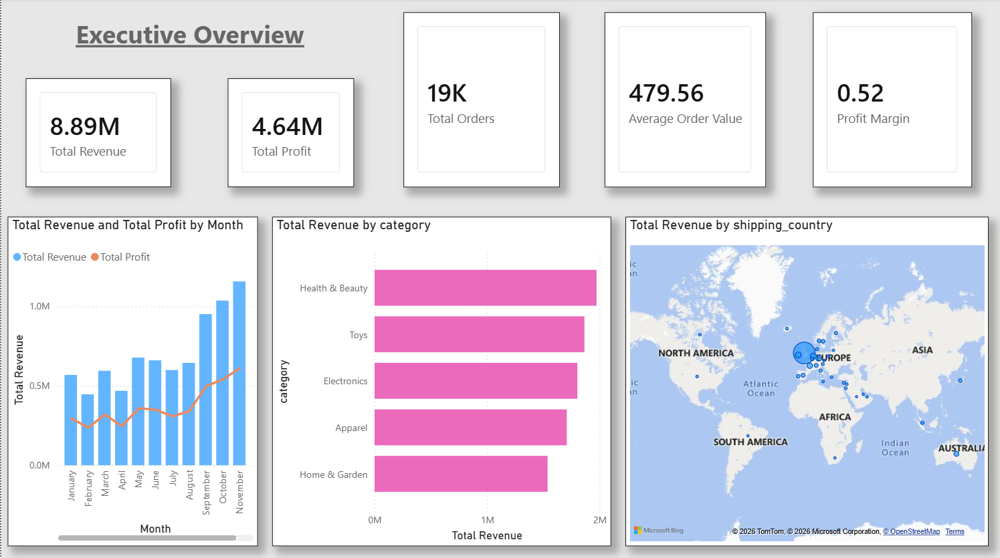
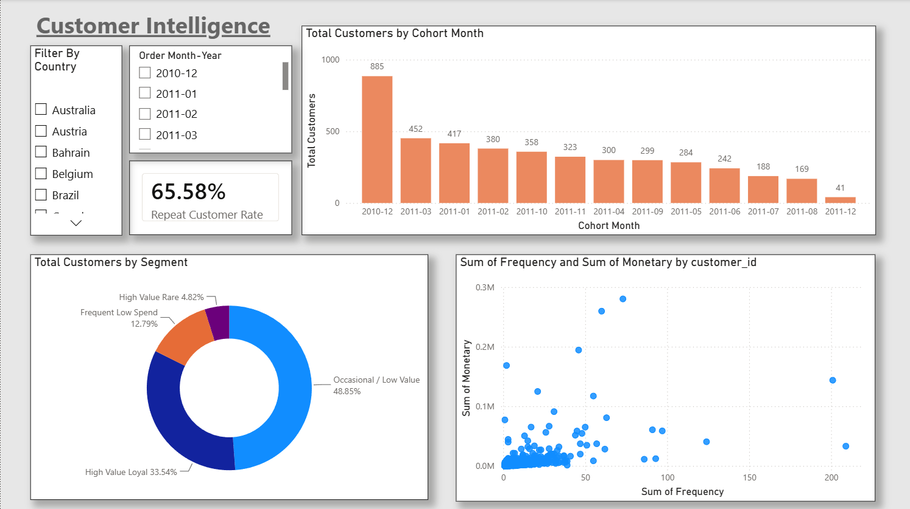
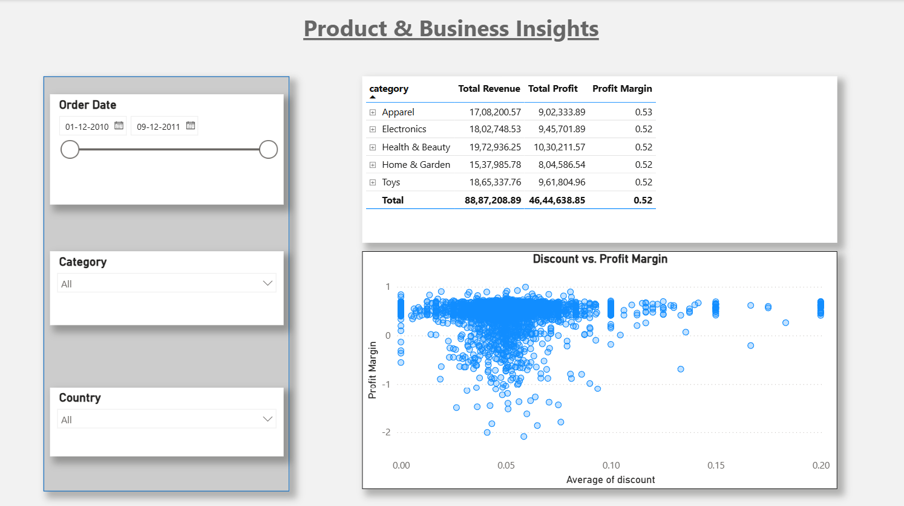
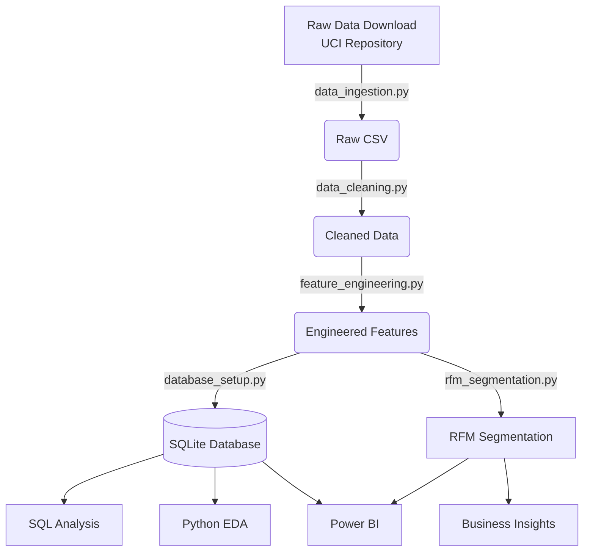

# E-Commerce Customer Analytics & Retention Intelligence


## 📌 Project Overview
This project is an end-to-end Data Analytics solution designed to extract actionable business intelligence from raw e-commerce transaction data. It focuses on understanding customer purchasing behavior, identifying high-value customers through RFM segmentation, and diagnosing retention issues to provide strategic business recommendations.

## 📈 Dashboard Previews

**1. Executive Overview**


**2. Customer Intelligence**


**3. Product & Business Insights**


## 🏢 Business Problem
The e-commerce business relies heavily on a small percentage of its customer base for revenue, but it lacks visibility into who these top customers are, why customers churn, and how promotional discounts affect overall profit margins. The business needed a full-scale analytics pipeline to move from raw data to strategic insights.

## 🎯 Objectives
* **Data Engineering:** Build an automated pipeline to ingest, clean, and normalize 500,000+ raw transactional records into a relational database.
* **Customer Segmentation:** Implement an RFM (Recency, Frequency, Monetary) model to segment customers into actionable marketing tiers (e.g., "Champions", "At-Risk").
* **SQL Analysis:** Perform advanced SQL querying to uncover trends in revenue, retention, and product performance.
* **Statistical Analysis:** Use hypothesis testing to determine the true impact of discounts on average order value.
* **Business Intelligence:** Design an interactive Power BI dashboard for executive reporting.

## 📊 Dataset
The project utilizes the **UCI Machine Learning Repository's Online Retail Dataset**, containing 541,909 real transactions occurring between 2010 and 2011 for a UK-based and registered non-store online retail. 

## 🏗️ Architecture & Workflow



## 💻 Tech Stack
* **Language:** Python (Pandas, NumPy, SciPy)
* **Database:** SQLite, Standard SQL
* **Visualization:** Matplotlib, Seaborn, Power BI
* **Environment:** Jupyter Notebooks

## 🗄️ Data Model (Star Schema)
The raw flat file was normalized into a relational Star Schema for optimized analytical querying:
* `customers` (Dimension)
* `products` (Dimension)
* `orders` (Fact)
* `order_items` (Fact)

## 📂 Project Structure
* `/data`: Contains raw and cleaned CSV files.
* `/notebooks`: Jupyter notebooks for EDA, RFM, and Statistical Analysis.
* `/src`: Python scripts for the automated data pipeline.
* `/sql`: DDL schema and business/advanced SQL queries.
* `/powerbi`: Instructions for data modeling and DAX measures.
* `/reports`: Actionable business insights and strategic recommendations.

## 🚀 How to Run Locally

1. **Clone the repository:**
   ```bash
   git clone https://github.com/yourusername/ecommerce-customer-analytics.git
   cd ecommerce-customer-analytics
   ```

2. **Install dependencies:**
   ```bash
   pip install -r requirements.txt
   ```

3. **Run the automated pipeline:**
   This will download the dataset, clean it, engineer features, segment customers, and build the SQLite database.
   ```bash
   python src/data_ingestion.py
   python src/data_cleaning.py
   python src/feature_engineering.py
   python src/database_setup.py
   python src/rfm_segmentation.py
   ```

4. **Explore the Notebooks:**
   Run `jupyter lab` to view the Exploratory Data Analysis and Statistical tests.

## 📈 Key Insights & Recommendations
* **Insight:** The "Champions" tier accounts for over 50% of total revenue despite being less than 20% of the customer base.
* **Recommendation:** Implement a VIP Loyalty Program targeting the "Champions" and "Potential Loyalists" to protect the primary revenue stream.
* **Insight:** Heavy discounts (15-20%) erode profit margins without generating enough volume to offset the loss.
* **Recommendation:** Shift from percentage discounts to "Free Shipping over $X" thresholds to increase Average Order Value while protecting margins.
* *(See `reports/business_insights.md` for the full list)*

---

# 📄 Resume Section (ATS-Friendly)

If you are adding this project to your resume, use these bullets:

**Data Analyst | E-Commerce Customer Analytics & Retention Intelligence**
* Engineered an automated Python ETL pipeline (Pandas, NumPy) to clean and normalize 500,000+ transactional records into a SQLite relational database, ensuring 100% data integrity for analysis.
* Developed an RFM (Recency, Frequency, Monetary) segmentation model in Python, identifying that the top 20% of customers drove >50% of total revenue, leading to targeted retention campaign recommendations.
* Authored 20+ advanced SQL queries (CTEs, Window Functions) to extract KPIs including Month-over-Month growth, repeat purchase rate, and cohort retention.
* Conducted statistical hypothesis testing (SciPy) to analyze promotional impact, discovering that 20% discounts negatively impacted overall profit margins compared to 5% discounts.
* Designed an interactive Power BI dashboard utilizing DAX and Star Schema modeling to present executive insights on product performance and customer churn.
