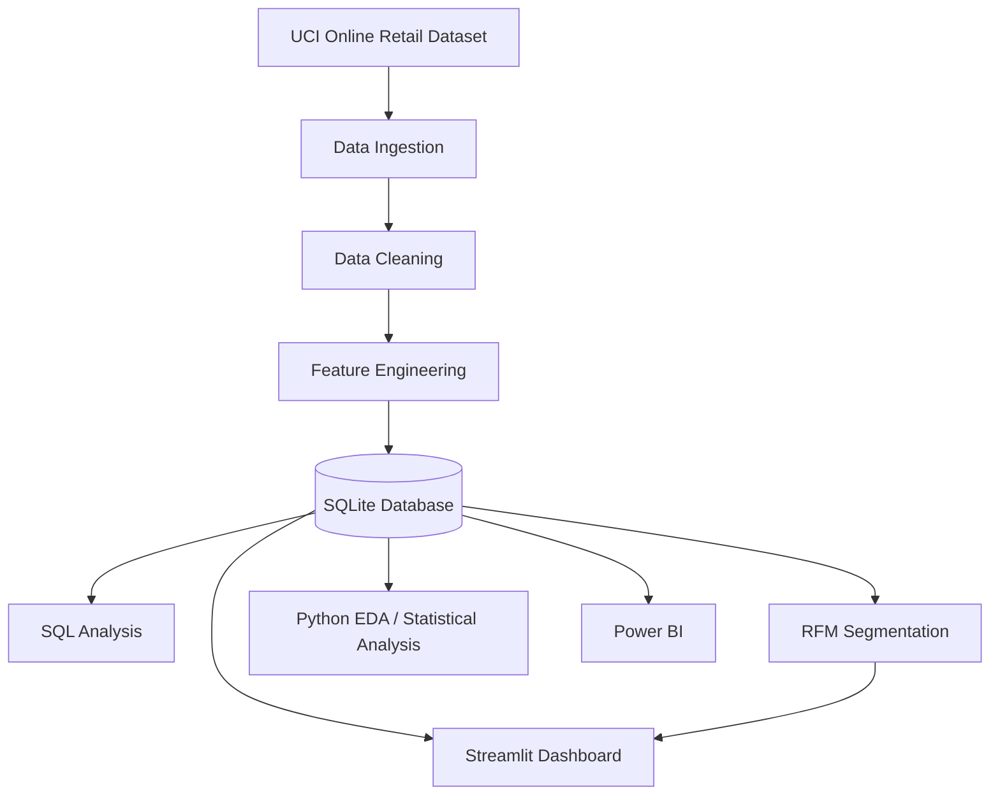

# E-Commerce Customer Analytics & Retention Intelligence


## 🚀 Live Demo

[Open the Interactive Dashboard](YOUR_STREAMLIT_APP_URL)

*(Note: The application has not been deployed to Streamlit Community Cloud yet. The URL will be updated upon deployment.)*

## 📌 Project Overview
**E-Commerce Customer Analytics & Retention Intelligence** is an end-to-end data analytics platform that processes 541K+ e-commerce transactions to analyze customer behavior, RFM segments, product performance, and retention patterns. The project combines Python data engineering, SQL/SQLite analytics, statistical analysis, Power BI, and an interactive Streamlit dashboard.

The pipeline processes approximately **541K raw transactions** from the UCI Online Retail dataset.

## 🏗️ Architecture & Workflow

The pipeline is fully automated. The Streamlit application can automatically initialize the pipeline when the processed database and data files are unavailable (such as during a fresh clone or cloud deployment).



## 📊 Interactive Dashboard

The project includes an interactive Streamlit dashboard with five analytical views:

1. **Executive Overview**: High-level KPIs, monthly revenue trends, order trends, country performance, and RFM revenue contribution.
2. **Customer Intelligence**: RFM segments, customer metrics, customer search, and detailed purchase history.
3. **Product & Business Analytics**: Top products by revenue, quantity, and order count with dynamic Top 10/20/50 controls.
4. **Retention & Customer Behavior**: Repeat customers, one-time customers, recency distributions, inactive customers, at-risk customers, and retention analysis.
5. **SQL Analytics**: Live SQL queries executed against the SQLite database with displayed query results.
6. **Data Explorer**: Inspect the SQLite database structure, table schemas, row counts, and sample records. Allows users to upload their own compatible SQLite database to power the dashboard.

## 🖥️ Dashboard Preview

**1. Executive Overview**


**2. Customer Intelligence**


**3. Product & Business Analytics**


**4. Retention & Customer Behavior**
*[Placeholder: Screenshot to be added]*

**5. SQL Analytics**
*[Placeholder: Screenshot to be added]*

## 💻 Tech Stack
* Python
* Pandas
* NumPy
* SciPy
* SQLite
* SQL
* Streamlit
* Plotly
* Matplotlib
* Seaborn
* Power BI
* Jupyter

## 📂 Project Structure

```text
ecommerce-customer-analytics/
├── .streamlit/
│   └── config.toml
├── app.py
├── assets/
├── notebooks/
├── powerbi/
├── README.md
├── reports/
├── requirements.txt
├── sql/
└── src/
```
*(Note: Directories such as `data/` and files like `ecommerce.db` are generated locally by the data pipeline and are excluded from version control.)*

## 🚀 How to Run Locally

1. **Clone the repository:**
   ```powershell
   git clone https://github.com/yourusername/ecommerce-customer-analytics.git
   cd ecommerce-customer-analytics
   ```

2. **Install dependencies:**
   ```powershell
   python -m pip install -r requirements.txt
   ```

3. **Start the Streamlit Application (Automatic Initialization):**
   ```powershell
   python -m streamlit run app.py
   ```
   *Note: On the first run, the Streamlit app will automatically detect missing data files, download the UCI dataset, clean the data, run the RFM segmentation, and build the SQLite database locally.*

**(Optional) Run the pipeline manually:**
For users who want to run the analytics pipeline step-by-step outside of Streamlit:
```powershell
python src/data_ingestion.py
python src/data_cleaning.py
python src/feature_engineering.py
python src/database_setup.py
python src/rfm_segmentation.py
```

## 🗄️ Data Explorer
The application includes a Data Explorer that allows users to inspect the SQLite database structure, table schemas, row counts, and sample records.

Users can also upload their own SQLite database.

Compatible SQLite database required. The uploaded database must follow the application's required schema, including the `customer_segments` RFM table. Arbitrary SQLite databases are not supported.

Required schema:
- `customers` (`customer_id`, `country`)
- `products` (`product_id`, `product_name`)
- `orders` (`order_id`, `customer_id`, `order_date`, `shipping_country`)
- `order_items` (`order_id`, `product_id`, `quantity`, `unit_price`, `revenue`)
- `customer_segments` (`customer_id`, `Recency`, `Frequency`, `Monetary`, `Segment`)

Uploaded SQLite databases are isolated to the current session and opened in read-only mode.

## ☁️ Deployment

The application is designed for deployment on Streamlit Community Cloud.

1. Push the repository to GitHub.
2. Open Streamlit Community Cloud.
3. Select the repository.
4. Select the `main` branch.
5. Select `app.py`.
6. Deploy.
7. Replace `YOUR_STREAMLIT_APP_URL` in this README with the generated public URL.

## 📊 Dataset Limitations
The project utilizes the UCI Machine Learning Repository's Online Retail Dataset (approximately 541,909 raw transaction records from a UK-based non-store online retailer, spanning 2010–2011).

The original dataset does not directly contain product cost, profit, profit margin, discount percentage, customer age, customer gender, or payment method. The project therefore does not claim to analyze those variables. The insights focus exclusively on verifiable metrics such as revenue, orders, customer behavior, RFM segmentation, retention behavior, product performance, and geographic performance.

## 📈 RFM Methodology
The project calculates Recency, Frequency, and Monetary metrics for each customer based on their historical purchase behavior:
* **Recency:** Days since the customer's last purchase.
* **Frequency:** Total number of distinct orders placed.
* **Monetary:** Total revenue generated by the customer.

Using the `src/rfm_segmentation.py` implementation, customers are assigned to analytical categories such as Hibernating, Champions, Loyal Customers, Potential Loyalists, At Risk, Average Customers, New Customers, and Cannot Lose Them. These segments are analytical classifications based on the observed data rather than scientifically validated psychological profiles.

## 💡 Key Business Takeaways
* **Customer Segmentation:** Champions represent approximately 22.1% of segmented customers. Their specific contribution to revenue is highlighted dynamically in the Executive Overview dashboard.
* **Customer Retention:** 32.4% of segmented customers are currently classified as Hibernating or At Risk under the project's RFM methodology.
* **Repeat Business:** Returning customers contribute substantially to overall purchasing activity, and the dashboard actively compares one-time and repeat customer behavior.

## 💼 Skills Demonstrated
This project serves as a comprehensive portfolio piece demonstrating the following skills:
* Data ingestion and cleaning
* Feature engineering
* Relational database design
* SQL analytics
* RFM customer segmentation
* Retention analysis
* Interactive BI/dashboard development
* Streamlit deployment
